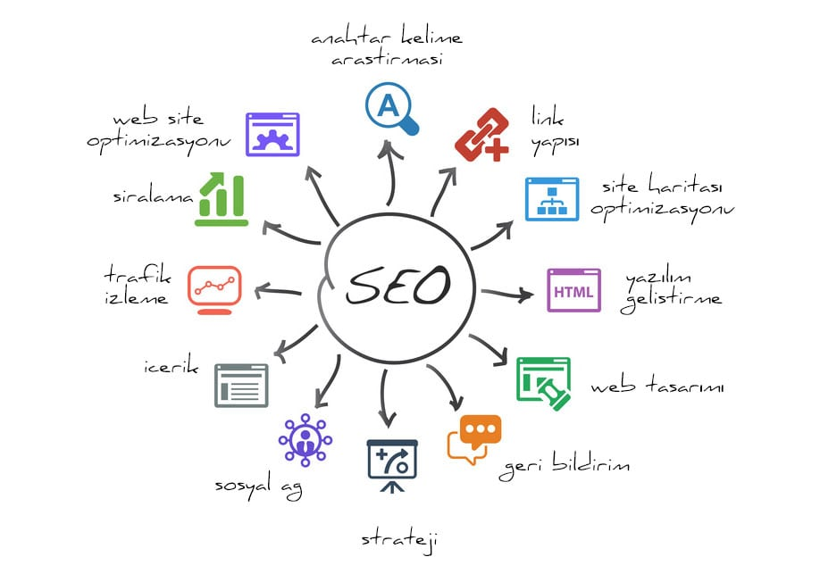

# 
SEO (Search Engine Optimization)

**1) SEO NEDİR?**

- SEO, web sitelerimizin arama motorlarında daha çok görünürlülük elde etmesini sağlamak için yapılan çalışmalar bütünüdür.

- SEO, sayfaları organik trafik yoluyla daha iyi sıralamak için optimize etmeye odaklanır. Bu, Google, Yandex veya Bing gibi arama motorlarından gelen site ziyaretçilerini ifade eder.

- Google botlarının rahat gezindiği ve kullanıcıların uzun zaman geçirdiği siteler kalite kavramına örnektir. Arama motorları web sitelerine, bazı kurallar dahilinde, kalite puanları vermektedir.

---

**2) SEO'DA NELERE DİKKAT ETMELİ?**

SEO çalışmaları yapılırken üzerinde durulan 5 çeşit sınıflandırılmadan bahsedeceğim.

- **On-Paging SEO (Site İçi)**
    
    - Anahtar kelime optimizasyonu  
    - Sayfa Başlık etiketleri (Title Tag) 
    - Başlık etiketleri (Header Tags)  
    - Görsel alt metni.
    - Meta Açıklaması. Sayfa başlığı ve URL ile birlikte snippet’ler olarak görünen SERP’lerdeki sayfaların kısa açıklamasını ifade eder. Meta açıklamalar, anahtar kelimeleri içerir ve sayfanın sağladığı bilgileri doğru bir şekilde tanımlar.

- **Off-Paging SEO (Site dışı)**
 
   - Bağlantı kurma, sosyal yardım pazarlaması ve misafir ilanı gibi web sitenizin dışındaki faaliyetleri içerir.
   -  ==Backlink==, bir web sitesinin diğer bir siteye verdiği linktir.
   - Forumlar

- **Technical SEO**
  
  - Web sitenizin hızını, uyumluluğunu, güvenliğini ve kullanım kolaylığını optimize etmek için SEO teknik yönlerini içerir.
  - Sayfa yükleme hızı
  - SSL sertifikası. SSL sertifikasına sahip bir web sitesi, URL’sinde HTTPS‘yi etkinleştirir.
  - Hızlandırılmış Mobil Sayfalar (AMP)
  - XML site haritaları

- **Locale SEO**

  - Yerel SEO, yerel işletmelerin arama sonuçlarındaki görünürlüğünü artırma faaliyetidir. Mesela Ankaradaki Balık Restoranları araması

 - **Black Hat SEO**

   - Çeşitli onaylanmayan yöntemlerle arama motorunun çalışmasını manipüle ederek bir sitenin ilgili veya hedef anahtar kelimede öne çıkmasını sağlamaya çalışma işlemidir. Yöntemlerden bazıları aşağıdaki şekilde sınıflandırılabilir.
   - Anahtar kelime yığınları
   - Çıkış sayfaları
   - Bilgisayar tarafından otomatik yazılan sayfalar

   ---
**3)SEO Nasıl Uygulanır?**

Google ve diğer arama motorları, kullanıcı sorgularını yanıtlamak için ilgili bilgileri toplamak, düzenlemek ve görüntülemek için vardır. SEO yapmak için, aşağıdakiler de dahil olmak üzere üç ana süreçten geçerler:

*Crawling* , Arama motorları, internette güncellenmiş içeriği bulmak için crawlers, bots veya spiders olarak da bilinen bot web tarayıcı ekibine güvenir. Web tarayıcıları, bir sayfayı dizine eklemek için gereken bilgileri keşfetmeye ve toplamaya yardımcı olur.

*Endeksleme* , Arama motorlarının toplanan web sayfalarını sakladığı ve düzenlediği bir süreci ifade eder. Web tarayıcıları bir sitede anahtar kelimeler ve yeni içerik gibi bilgiler bulduklarında, web sayfasını arama dizinine eklerler. Kullanıcılar ilgili bilgileri aradıklarında, arama motoru dizine eklenen web sitesini getirir.

*Sıralama* , Arama dizinindeki web sayfaları, arama sonuçlarında en alakalı içerikten en az alakalı içeriğe kadar görüntülenecektir.

---

[KAYNAK](https://www.hostinger.web.tr/rehberler/seo-nedir/#Sayfa_Disi_SEO_calismasi_nedir_Off-page_SEO_Nasil_Yapilir)

[KAYNAK](https://www.seocu.com/seo)
