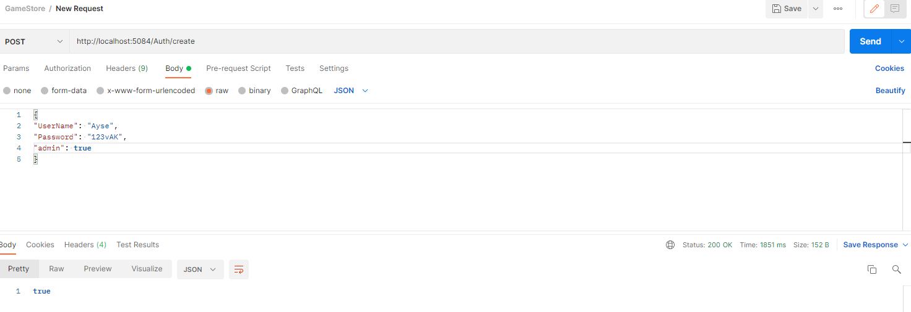
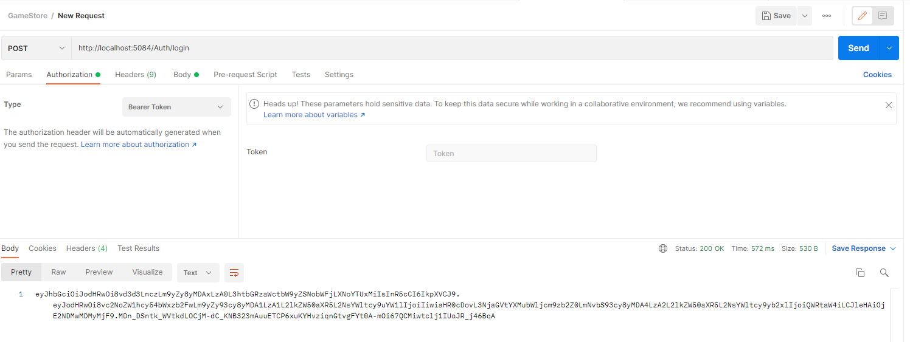
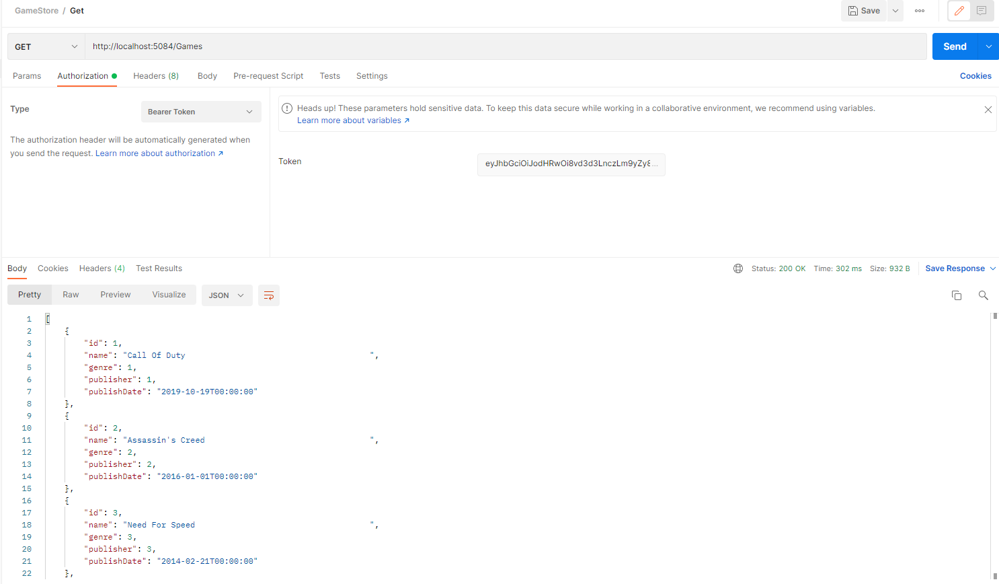
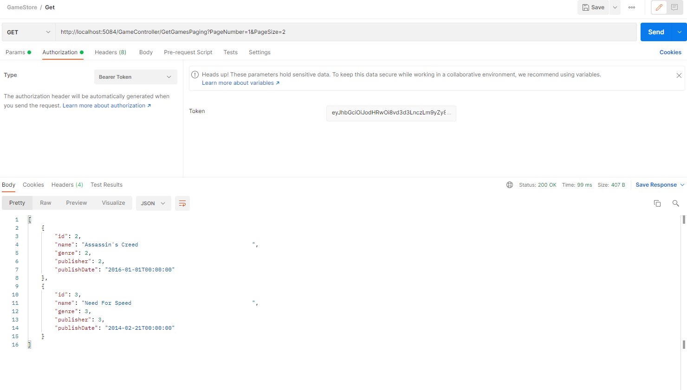
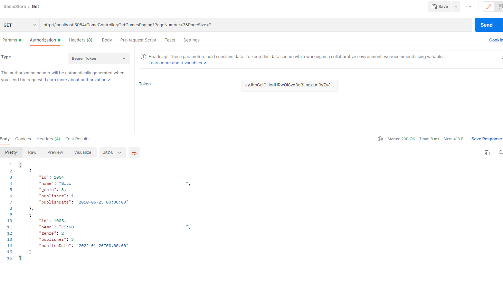

# Week 5
## Authorization Operations

**Please check the [AuthorOperations](https://github.com/AKBANK-Patika-FullStack-Bootcamp/EceBasturk_HW/blob/main/Week5_GameStore/GameStore/Controllers/AuthOperations.cs) and [AuthorConttroller](https://github.com/AKBANK-Patika-FullStack-Bootcamp/EceBasturk_HW/blob/main/Week5_GameStore/GameStore/Controllers/AuthController.cs) clasess.**

**1)** Create login and hashing.

---

**2)** Login operation with token.

---

**3)** GetGames with BearerToken Authorization

---

**4)** GetGames Paging

